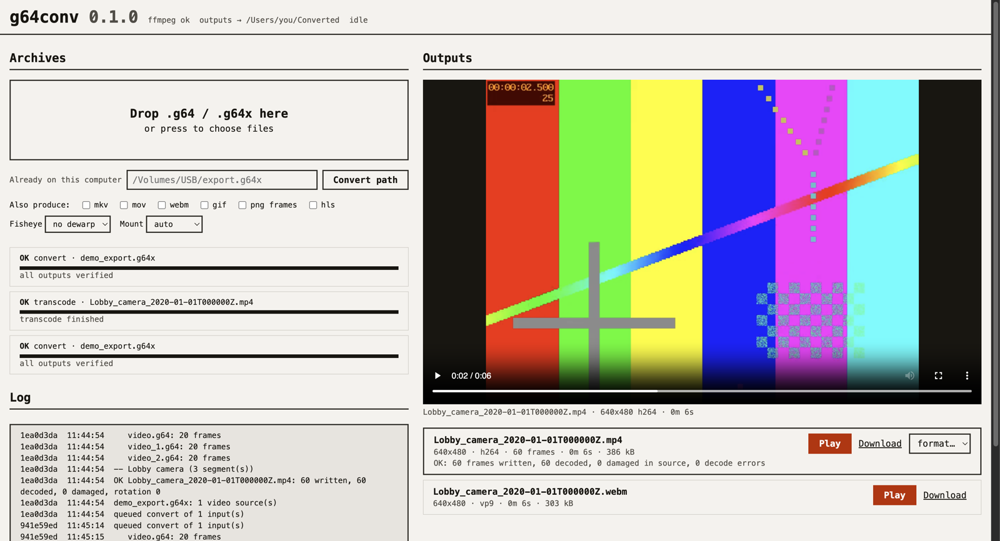

# g64conv

Convert Genetec Security Center / Omnicast video exports (`.g64` segments and
`.g64x` export archives) into standard video, natively, on macOS, Linux or
Windows. No Wine, no vendor player, no re-encoding of the evidence: the camera's
H.264 stream is copied bit-exact into an MP4 with the original 1 ms frame
timestamps, and the camera's display rotation is carried along as metadata.
From that MP4, one flag turns the footage into MKV, MOV, WebM, GIF, PNG frames
or an HLS stream, and circular fisheye ("360") cameras can be split into two
normal-looking views.

Anyone who receives one of these exports (records requests, court discovery,
a security office, a journalist, a defendant) has so far needed the vendor's
Windows-only player to even look at it. This tool removes that limit.
[docs/why.md](docs/why.md) compares every free and paid alternative that
could be found, with sources: g64conv is the only free converter that runs on
macOS and Linux, needs no vendor software, and does not depend on how the
export was made.

## Press

- ["You won the records request. Now the video won't open."](https://nyopengov.org/blog/genetec-video-foil-free-fix/) — NY Open Gov, September 2026. On how proprietary `.g64`/`.g64x` exports leave FOIL requesters holding a file they can't open, and why g64conv closes that gap.

## Install

### macOS and Linux (no Python required)

Install FFmpeg once, then run the installer. It selects your processor,
checks the download's SHA-256, and installs into your own account without sudo.
Python and PyAV are included in the download; FFmpeg and ffprobe are separate.

**macOS:** install [Homebrew](https://brew.sh/) if needed, then:

```sh
brew install ffmpeg
```

**Ubuntu / Debian:**

```sh
sudo apt update && sudo apt install -y ffmpeg curl
```

On other Linux distributions, install FFmpeg (including `ffprobe`) and curl
with your package manager. Then, on either macOS or Linux:

```sh
curl -fsSL https://github.com/barkleesanders/g64conv/releases/latest/download/install.sh -o /tmp/g64conv-install.sh
sh /tmp/g64conv-install.sh
export PATH="$HOME/.local/bin:$PATH"
g64conv gui
```

You can [read the installer](install.sh) before running it. Add the `export PATH`
line to `~/.zshrc` (macOS) or `~/.bashrc` (Bash on Linux) to keep the command
available in new terminals. The GUI opens in your browser and runs locally.
For the command line, use `g64conv convert export.g64x`.

### Direct downloads

Prefer extracting an archive yourself? Download the build for your computer:

| Computer | Download |
|---|---|
| Mac with Apple Silicon (M1/M2/M3/M4 or newer) | [macOS ARM64](https://github.com/barkleesanders/g64conv/releases/latest/download/g64conv-macos-arm64.tar.gz) |
| Mac with Intel processor | [macOS x86_64](https://github.com/barkleesanders/g64conv/releases/latest/download/g64conv-macos-x86_64.tar.gz) |
| Linux on Intel / AMD 64-bit | [Linux x86_64](https://github.com/barkleesanders/g64conv/releases/latest/download/g64conv-linux-x86_64.tar.gz) |
| Linux on ARM64 / aarch64 | [Linux ARM64](https://github.com/barkleesanders/g64conv/releases/latest/download/g64conv-linux-arm64.tar.gz) |

[All releases](https://github.com/barkleesanders/g64conv/releases) ·
[SHA-256 checksums](https://github.com/barkleesanders/g64conv/releases/latest/download/SHA256SUMS) ·
[Installer download](https://github.com/barkleesanders/g64conv/releases/latest/download/install.sh)

Extract the archive, keep the entire `g64conv` directory together, and run
`./g64conv/g64conv gui` from the directory where you extracted it. These are
terminal executables, not a Finder `.app` or a Windows `.exe`.
FFmpeg and ffprobe must be on your PATH for conversion.

The native release tests run on macOS 14 (Apple Silicon), macOS 15 (Intel),
Ubuntu 22.04 (x86_64), and Ubuntu 24.04 (ARM64). Older macOS versions and
Linux distributions with older glibc are not covered by these builds; Alpine
(musl) should use the Python installation below. The Mac builds are not
Apple-notarized. If macOS blocks a downloaded executable, use the system's
Privacy & Security approval after checking the release and checksum.

### Update or remove

**Update:** repeat the installer commands above. The installer downloads the
latest release and switches the command only after its version check succeeds.
Close and reopen an already-running GUI to use the new version. Previous
versions are kept in `~/.local/lib/g64conv` so an active conversion is not
interrupted. To install a specific release:

```sh
G64CONV_VERSION=v0.2.0 sh /tmp/g64conv-install.sh
```

To remove an installer-managed copy, stop the GUI, delete the symlink
`~/.local/bin/g64conv`, and move `~/.local/lib/g64conv` to the Trash.
Your archives and converted videos are stored separately and remain yours.
`G64CONV_PREFIX=/absolute/path sh /tmp/g64conv-install.sh` installs under a
different prefix; use that same prefix for updates and removal.

### Python / pipx (also available on Windows)

If you prefer a Python installation, use Python 3.10+ and pipx
(there is no PyPI release yet):

```
pipx install "git+https://github.com/barkleesanders/g64conv"
```

`pip install "git+https://github.com/barkleesanders/g64conv"` works the same
way inside any Python 3.10+ environment. PyAV comes with it; `ffmpeg` and
`ffprobe` must be on the PATH (`brew install ffmpeg`, `apt install ffmpeg`,
`winget install ffmpeg`, or a static build from ffmpeg.org).

Update a pipx installation with `pipx upgrade g64conv`. Do not mix pipx and
the native installer at the same command path; the installer refuses to
overwrite a command managed by another tool.

```
g64conv convert export.g64x    # one MP4 per camera, verified frame-for-frame
g64conv gui                    # or: drop the archives on a page in your browser
```

## What you get

```
$ g64conv convert /media/usb/export/1234_export.g64x -o out --format mkv --format webm --dewarp double --json
== /media/usb/export/1234_export.g64x: 2 video source(s)
-- Lobby (6 segment(s))
OK          out/Lobby_2026-08-04T140056Z.mp4  [720x720 h264, 25938 video frames of 25944 (6 metadata-only, 0 damaged), 6483.6s, rotation 0, start 2026-08-04T14:00:56.250000+00:00]
            mkv: out/Lobby_2026-08-04T140056Z.mkv
            webm: out/Lobby_2026-08-04T140056Z.webm
            dewarp: ['out/Lobby_2026-08-04T140056Z_A.mp4', 'out/Lobby_2026-08-04T140056Z_B.mp4']
```

- **One MP4 per camera.** The `_1.._N` continuation segments of a camera are
  joined into one file with their real timestamps, so a recording gap stays a
  gap instead of being papered over.
- **Verified, not assumed.** Every output is fully decoded with `ffprobe
  -count_frames` and must yield exactly the number of frames written, with no
  decoder diagnostics. Frames the *recorder* stored incomplete (a missing RTP
  packet) are counted, timestamped in the report, and the run exits `4` so a
  script can tell "clean" from "clean except these four frames".
- **Rotation preserved.** The archive carries the camera's mounting rotation as
  a side-channel message; it becomes an MP4 display matrix (pixels untouched).
- **Agent/script friendly.** `--json` (report on stdout, progress on stderr),
  `--quiet`, `--dry-run`, `--no-color`, `--report file.json`, and typed exit
  codes: `0` verified, `2` usage/missing input, `3` failed, `4` partial (source
  damage), `5` missing ffmpeg/PyAV.

## The local web GUI

```
g64conv gui -o ~/Converted        # opens http://127.0.0.1:8765/ in your browser
```



Drop `.g64` / `.g64x` files on the page (or name a path already on the
computer, so a 30 GB USB export is not copied), tick any extra formats and the
fisheye option, and watch the job: a progress bar per job and a lab-notebook
log with every segment, frame count and verification result. Each output is
listed with its dimensions, frame count, duration, rotation and the
verification line (frames written vs decoded, damaged source frames, decode
errors), a Play button that plays it right there, a Download link, and menus to
produce another format or a dewarped view from it.

Everything stays on your machine: the server listens on 127.0.0.1 only, the
page loads no fonts, scripts or CDN, and it works offline. It also refuses
requests whose `Host` is not loopback (DNS rebinding) and any state change that
does not carry the `X-G64conv` header, which a page from another origin cannot
add without a CORS preflight this server never grants. Nothing is ever deleted
by the GUI. `--port 0` picks a free port; `--no-browser` just prints the URL.

## Commands

| Command | Purpose |
|---|---|
| `g64conv convert <archive...> [-o DIR] [--format F]... [--dewarp double\|panorama] [--mount auto\|ceiling\|wall] [--keep-h264]` | archives to MP4 (+ other formats, + dewarped views) |
| `g64conv transcode <video.mp4> --format mkv\|mov\|webm\|gif\|frames\|hls [--fps N] [--width W]` | any MP4 into other formats |
| `g64conv dewarp <fisheye.mp4> [--mode double\|panorama] [--mount auto\|ceiling\|wall] [--fov 180] [--width W]` | turn a fisheye circle into normal views |
| `g64conv gui [-o DIR] [--port 8765] [--no-browser]` (alias `web`) | local web page: drop archives, convert, play the results |
| `g64conv probe <archive> [--json]` | header, frame count, RTP/NAL histogram, frame intervals, rotation |
| `g64conv synth <any-video> out.g64x [--segment-seconds N]` | write a synthetic archive (test fixtures, bug reports) |

`mkv`/`mov`/`hls` are lossless container changes (stream copy). `webm` (VP9),
`gif` and `frames` re-encode, so they are for sharing and review, not for
evidence; keep the MP4.

### Fisheye "360" cameras

A fisheye camera stores a circular image, and how it is mounted decides what
that circle means. The tool handles both mountings and, by default, measures
which one it is looking at (`--mount auto`):

- **Ceiling** (looking straight down): the floor fills the middle, the walls
  form a ring near the rim. `--dewarp double` produces two normal 180-degree
  views (`_A.mp4`, `_B.mp4`), the same "double panorama" idea the vendor
  client offers; `--dewarp panorama` produces one 360-degree strip. This is
  ffmpeg's `v360` filter (`fisheye` in, `hequirect` out, `pitch=90`,
  `rorder=pyr`, `yaw=0|180`).
- **Wall** (looking horizontally out of a wall): only the lower hemisphere has
  picture, the upper half of the circle is black because the camera masks it.
  People already stand upright, so one view (`_wall.mp4`, `pitch=0`) is
  produced that straightens the verticals and flattens the barrel distortion.
  Auto-detection reads a frame and compares the upper and lower halves against
  the frame's own black level (video black is 16, not 0). Force it with
  `--mount ceiling|wall` if a scene fools it.

Both are cropped to the band from 15 degrees above the horizon down to the
nadir. The projections are verified in the test-suite on a synthetic room with
coloured walls and an asymmetric marker, once per mounting: wall order and
handedness are preserved (nothing is mirrored) and the floor ends up at the
bottom. If the lens is not 180 degrees, pass `--fisheye-fov`. Dewarping is a
re-encode (libx264 CRF 18); the bit-exact MP4 is still written alongside it.

## The format

Written down from the files themselves and from how the vendor player reads
them, in our own words; this repository contains no vendor code. All values
little-endian unless noted.

**File header**
- 30 B start code `Genetec Omnicast Archive v5.31` (v2.00 through v5.32 exist; v5.32 adds a 1 B "header encrypted" flag, not supported)
- 8 B end time, Windows FILETIME UTC (`-1` = unknown)
- 52 B time zone block (48 B before v4.10): u64 index, i32 bias minutes, ...
- 16 B collection GUID + name (i32 char count, UTF-16LE); v5.30+: encoder GUID + name, usage / origin / media-type GUIDs
- i32 file properties (bit 1 = SRTP-encrypted frames, not convertible without the key)
- v4.03+: i32 byte length + UTF-16LE XML
- 1 B watermark flag; if set: i32 public-key length + key, i16 data length, u16 type, data
- v5.31+: u16 third-party watermark type

**Footer marker** right after the header: 1 B "seek table at end of file" (if 0: i32 size + inline table), then 4 B padding, then the first frame. The seek table, if any, sits at the end of the file with its size in the last 4 bytes.

**Frame**
- 8 B FILETIME start time (`-1` or all-zero ends the chain), 1 B option flags (bit 2 = keyframe), u32 payload size
- payload: if the RTP payload-type byte is 102 ("archiver frame"): a 12 B RTP header, then repeated `{u8 version, u8 VideoCompressionType, u16 BE length, 2 B pad}` + one RTP packet; otherwise the payload is one RTP packet
- watermark data (length from the header) if the file is watermarked, then u32 trailer = payload size + 13

**RTP packets** carry H.264 per RFC 6184 (single NAL, STAP-A, FU-A) on payload
type 96; SPS/PPS are in-band on every IDR. Payload type 103 is a vendor
"decoder message": 4 opaque bytes, then a 14 B big-endian header
`{i16, i16 type, i16 compression, u32, u32 body_len}` and a body; type 4 is the
display rotation in degrees as ASCII (clockwise; ffmpeg's `-display_rotation`
is counter-clockwise, so the tool tags `360 - deg`). Payload type 126 is a
metadata frame with no video. `VideoCompressionType` values seen: 24
(generic H.264), 31 (Axis H.264); the tool treats every H.264 type alike and
refuses HEVC types with a clear message (no sample available to verify).

**`.g64x`** is a stored (uncompressed) zip: the `.g64` video segments, `.g64m`
metadata tracks (motion/analytics, skipped), and a `FileInfo.xml` manifest
listing each source and its segments' start/end times. Without a manifest the
tool groups segments by base name and orders `_N` suffixes numerically.

## Tests and the synthetic writer

`g64conv synth` writes a valid v5.31 archive from any video (`ffmpeg
testsrc2` in CI), so the whole pipeline is tested without any real footage:
header round trip, three-segment join, frame-for-frame `framemd5` equality
between the archive's H.264 and the produced MP4, a deliberately damaged
keyframe being reported (not hidden), the CLI's exit codes and JSON report,
every output format, the dewarp geometry on synthetic ceiling- and
wall-mounted fisheyes, the mount detection on both, and the web GUI (upload,
convert, Range playback, transcode, the request guards, a failing input). Run
`pytest` (needs ffmpeg).

## Limits

- H.264 only. HEVC/AV1/MJPEG archives are refused with a message; contributions
  with a sample welcome.
- No audio track handling yet (audio frames are a separate segment type in this
  format; none were present in the archives used to develop this).
- Password-encrypted (v5.32) and SRTP-encrypted archives cannot be read.
- Watermark data is skipped, not verified. Verifying the signature chain would
  need the vendor's public-key scheme.

## Why not the vendor engine under Wine

The Windows player is a large virtualised package; driven headlessly under
Wine, its conversion engine gets as far as `ErrorOccured (Undefined global
resource)`, a placeholder for a localisation lookup that only the GUI
bootstrap initialises, so the real error is unreachable. Decoding the format
directly turned out to be smaller, portable and verifiable.

## License

MIT.
